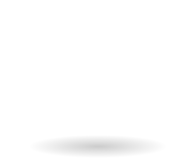

#  html template - Creative Digital Agency

by Alaa mohammed Ali - king khaled university

A very professional and highly customizable template with lots of custom pages and useful features fora Creative Marketing Agency

# Description

This template uses the following:
* Modern CSS
* BEM Methodology
* Custom 4 column grid
* SASS

# Installation

1. Clone the project to your local directory

*** https://github.com/alaa99975/agency_html_template
 
1. The project uses NPM for managing dependencies. Run npm install to install all the required dependencies
1. Run the watch script to view live changes to your CSS
1. Open the index.html file in your browser to view the website in all its glory (Live-server is recommended to view live changes automatically)

### ** Some examples of using your code**
`<!DOCTYPE html>
<html lang="en">

  <head>
    <meta charset="UTF-8">
    <meta name="viewport" content="width=device-width, initial-scale=1.0">
    <meta http-equiv="X-UA-Compatible" content="ie=edge">
    <link href="https://fonts.googleapis.com/css?family=Lato:100,300,400,700,900" rel="stylesheet">

    <link rel="stylesheet" href="css/style.css">
    <title>NeoDigital</title>
  </head>

  <body>
    <header class="header">
      <nav class="nav">
        
        <ul class="nav__list">
          <li class="nav__item"><a href="#">Services</a></li>
          <li class="nav__item"><a href="#">Welcome</a></li>
          <li class="nav__item"><a href="#">About</a></li>
          <li class="nav__item"><a href="#">Get in touch</a></li>
        </ul>
      </nav>

      

        

          <ul>
            <li>&nbsp;</li>
            <li>&nbsp;</li>
            <li>&nbsp;</li>
          </ul>
        

        <h1 class="heading-primary">Creative Digital Agency</h1>
        
Neque porro quisquam est qui dolorem ipsum quia dolor
          sit
amet,
          consectetur,adipisci velit.

        <a href="#" class="btn btn--full btn--animate">Find out more</a>
      

      
    </header>

    <main>

      <section class="section-visit">
        

          

            <h3 class="heading-tertiary">Clean Design</h3>
            

              It is a long established fact that a reader will 
be distracted by the readable
              content
              of a 
page when looking at its layout.
            

            <a href="#" class="btn btn--full">Visit website</a>
          

          

            <h3 class="heading-tertiary">Design</h3>
            

              It is a long established fact that a reader will 
be distracted by the readable
              content
              of a page when looking at its layout.
            

            <a href="#" class="btn btn--full">Contact us</a>
          

        

      </section>

      <section class="section-services">
        

          <h2 class="heading-secondary">Our Services</h2>
          
Neque porro quisquam est qui dolorem ipsum quia dolor
            sit
amet,
            consectetur,adipisci velit.

          

            <ul class="service-box__list">
              <li class="service-box__item"><a href="#">UI/UX</a></li>
              <li class="service-box__item"><a href=#>Responsive Design</a></li>
              <li class="service-box__item"><a href=#>Development</a></li>
              <li class="service-box__item"><a href=#>Mobile Apps</a></li>
              <li class="service-box__item"><a href=#>Commerce</a></li>
            </ul>
            

              

                

                  
                

                

                  <h3 class="heading-tertiary heading-tertiary--left">We made UI / UX Design</h3>
                  
Neque porro quisquam est qui dolorem ipsum quia
                    dolor sit
                    amet, consectetur, adipisci velit. Neque porro quisquam est qui dolorem
                    ipsum quia
                    dolor sit amet, consectetur, adipisci velit...

                  

                    Neque porro quisquam est qui dolorem ipsum quia dolor sit amet,
                    consectetur,
                    adipisci velit.
                  

                

              

            

          

        

      </section>

      <section class="section-clients">
        
        
        
        
      </section>

  

   

    </main>

  
  </body>

</html>`
